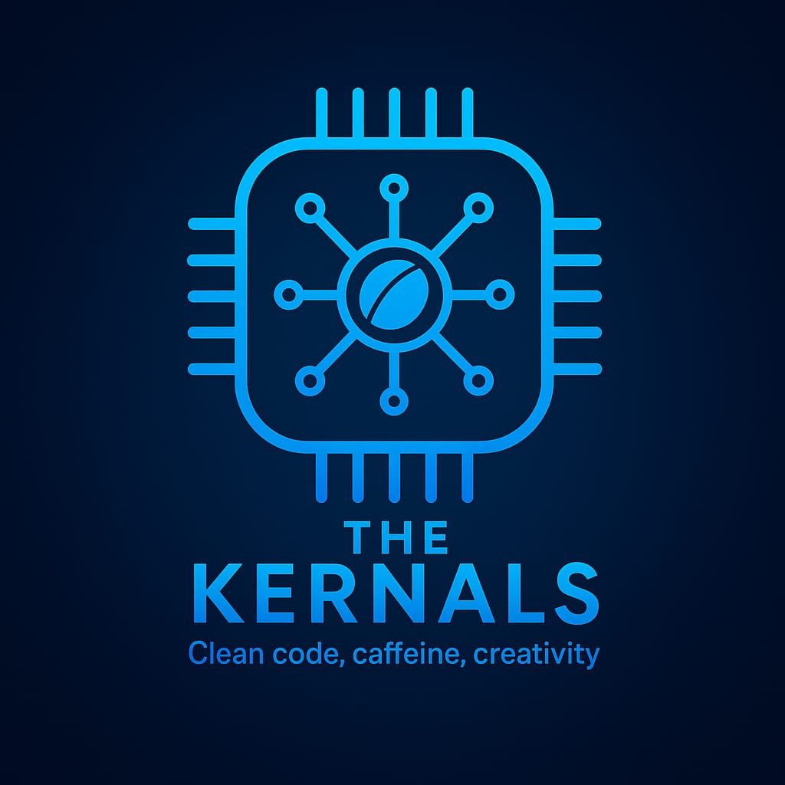

# ⚡ The Kernals – Team Charter

## 👥 Section 1 – Team Identity (by Deema AL-Maqadma):
*Team Name:* The Kernals  
*Slogan:* Clean code, caffeine, creativity  
*Logo:*  

We are a team of passionate coders who believe in debugging the impossible, together.  
Our identity is built on clean code, strong coffee, and endless creativity.

## 🧑‍💻 Section 2 – Team Size & Structure (by Lama Barhoom):
We are a team of **5 members**, each bringing unique skills and energy.  
Our structure is flat and collaborative — everyone contributes, everyone leads.

## 💬 Section 3 – Communication & Sync (Mona Abu Nada):
We communicate via **Slack**, with a dedicated channel for updates and casual chats.  
We hold a **daily stand-up meeting** to sync progress, unblock tasks, and share ideas.

